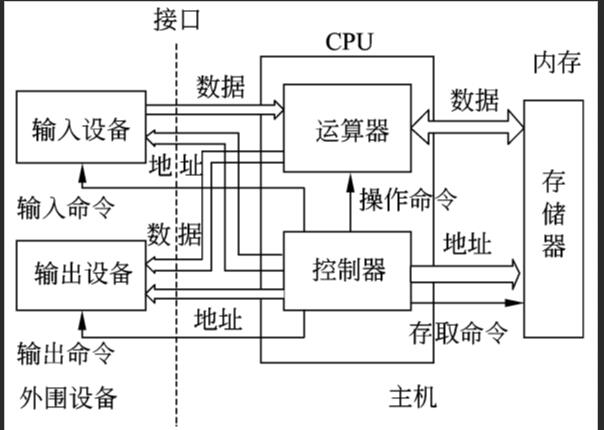
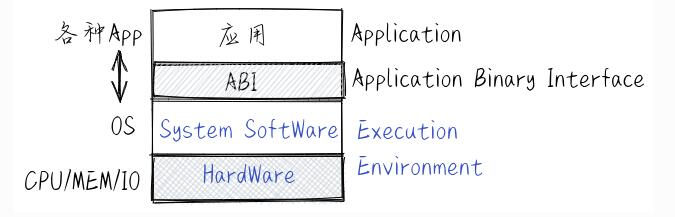
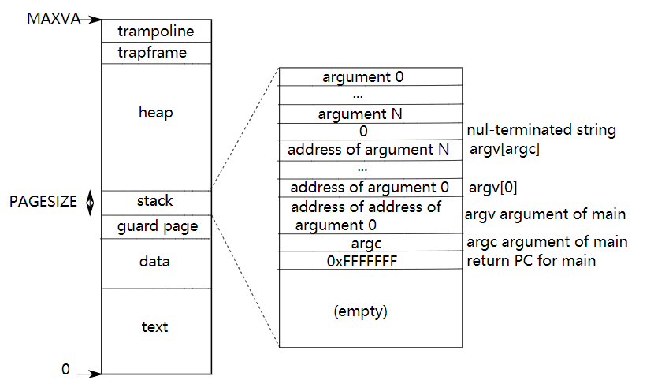
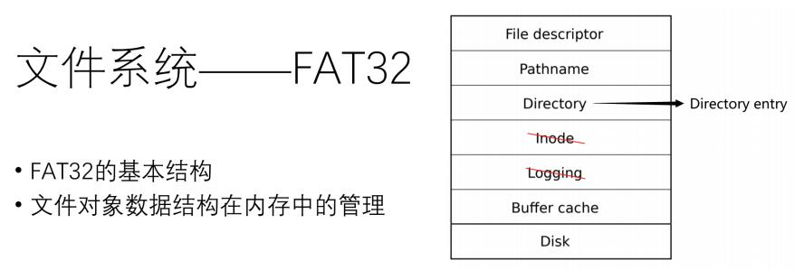
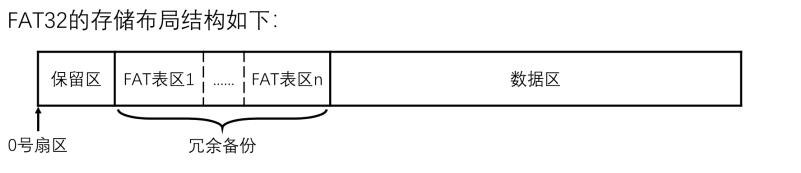
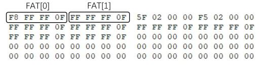
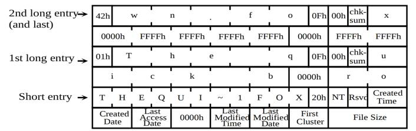
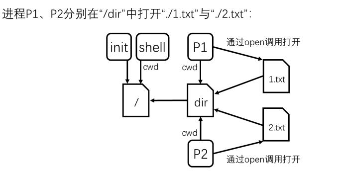

#   DancerInFarron队伍——OS文档总结 
> 说明：本项目是对华中科技大学同学所开发的xv6-k210[]进行的部分注释版，对于比赛来说由于时间和精力有限，小组开发的OS并没有完成文件系统，因此无法跑测试用例，故临时打算对xv6-k210项目进行注释，并写此文档(未完成)，虽然没有完成比赛，但是还是希望通过此文档对我们这几个月来的学习成果进行一些总结。
>
> 文档引用材料来源：
>
> https://rcore-os.github.io/rCore-Tutorial-Book-v3/index.html，
>
> https://github.com/DeathWish5/ucore-Tutorial-Book，
>
> https://zhuanlan.zhihu.com/p/150571417，
>
> http://www.itqiankun.com/article/file-fd，
>
> https://pan.educg.net/api/v3/file/get/3851/xv6-k210%E7%AE%80%E5%8D%95%E6%8C%87%E5%8D%97.pdf?sign=pJejma9ILmFlYszY4_sTbzzc9V2sONCegLClEBuY4qc%3D%3A0，
>
> https://xiayingp.gitbook.io/build_a_os/traps-and-interrupts/untitled-3


## 1 环境搭建和运行展示

我们在进行项目设计的过程中采用的是Ubuntu18.04操作系统，使用的VMWARE 15 pro安装并进行相关设计。
需要的依赖环境有RUST开发环境配置（因为项目用到了RUSTSBI），QEMU模拟器和RISCV工具链的配置。
将项目git下来后操作步骤如下

在qemu平台上：

```
make fs
make run platform=qemu
```


## 2 xv6-k210的项目结构
代码树展示
```
DANCERINFARRONOS
│  Makefile
│  OS文档.md
│  README.md
├─.vscode
├─bootloader
│  └─SBI
│      │  sbi-k210
│      │  sbi-qemu
│      │
│      ├─rustsbi-k210
│      │
│      └─rustsbi-qemu
│
├─kernel（内核代码部分）
│      bio.c    (高速缓存部分)
│      console.c(管理控制台部分)
│      disk.c   (选择硬盘分配方式是按qemu还是k210)
│      dmac.c   (K210)
│      entry_k210.S (K210的内核执行环境的汇编代码)
│      entry_qemu.S (qemu的内核执行环境的汇编代码)
│      exec.c   (内存管理部分，将程序段加载到虚拟地址页表等操作)
│      fat32.c  (fat32文件系统)
│      file.c   (文件的相关操作)
│      fpioa.c  (K210所需要的部分)
│      gpiohs.c (K210所需要的部分)
│      intr.c   (禁用和开启中断)
│      kalloc.c (物理内存分配)
│      kernelvec.S  (保存&&恢复全部寄存器，加载kerneltrap等，主要用于中断)
│      logo.c   (logo标识)
│      main.c   (进行整个OS的初始化进行)
│      pipe.c   (用于进程间通信)
│      plic.c   (Platform-Level Interrupt Controller，平台级中断控制器)
│      printf.c (打印函数相关)
│      proc.c   (进程实现)
│      sdcard.c (K210所需要的部分)
│      sleeplock.c  (sleep调用的专门实现)
│      spi.c    (K210所需要的部分）
│      spinlock.c   (互斥原语的实现)
│      string.c (String相关函数的实现)
│      swtch.S  (上下文交换，主要与各态之间的切换)
│      syscall.c    (系统调用的接口)
│      sysctl.c (K210所需要的部分)
│      sysfile.c    (有关文件部分系统调用的接口的具体实现)
│      sysproc.c    (系统调用程序部分的具体实现)
│      timer.c  (计时器的实现)
│      trampoline.S (用户态到内核态的“跳板”)
│      trap.c   (中断处理)
│      uart.c   ()
│      utils.c  (K210所需要的部分)
│      virtio_disk.c(qemu)
│      vm.c     (虚拟内存部分)
│
├─libs（存放引用的头文件）
│
├─linker（链接文件）
│      k210.ld
│      qemu.ld
│
├─pic（md文件引用的图片）
|
├─test_example（测试程序）
|
├─tools（烧写至k210的工具文件）
│      flash-list.json
│      kflash.py
│
└─user(存放写的用户程序)
```


## 3 做出的部分修改

由于xv6-k210本身的完成度已经非常高了，因此只需要修改libs/sysnum.h文件中的系统调用号即可，修改完毕后需要对makefile文件作出相应的修改。

在本地进行测试结果如下：

==插入相关图片==


## 4 操作系统概述

### 4.1 一般的计算机硬件架构

​	一台计算机可抽象一台以图灵机（Turing Machine）为理想模型，以冯诺依曼架构（ Von Neumann Architecture）为实现模型的电子设备，包括CPU、memory和 I/O 设备。CPU(中央处理器，也称处理器) 执行操作系统中的指令，完成相关计算和读写内存，物理内存保存了操作系统中的指令和需要处理的数据，外部设备用于实现操作系统的输入（键盘、硬盘），输出（显示器、并口、串口），计时（时钟）永久存储（硬盘）。操作系统除了能在计算机上运行外，还要管好计算机。



### 4.2 什么是操作系统

​	现在的通用操作系统是一个复杂的系统软件，站在高处向下宏观的看操作系统，可以发现OS主要做两件事情：一是向下管理计算机硬件和各种外设，二是向上给应用软件提供各种服务帮助。

​	可对其进一步描述：操作系统是一个可以管理CPU、内存和各种外设，并管理和服务应用软件的软件。这样的描述也是大多数操作系统教材上对操作系统的一个比较概括的定义。为了完成这些工作，操作系统需要知道如何与硬件打交道，如何更好地面向应用软件做好服务，这就有一系列操作系统相关的理论、抽象、设计等来支持如何做和做得好的需求。


​	站在应用程序的角度来看，我们可以发现常见的应用程序其实是运行在由硬件、操作系统、运行时库、图形界面支持库等所包起来的一个执行环境中，应用程序只需根据与系统软件约定好的应用程序二进制接口 (ABI, Application Binary Interface) 来请求执行环境提供的各种服务或功能，从而完成应用程序自己的功能。基于这样的观察，我们可以把操作系统再简单一点地定义为： 应用程序的软件执行环境 。从这个角度出发，操作系统可以包括运行时库、图形界面支持库等系统软件，也能适应在操作系统发展的不同历史时期对操作系统的概括性描述和定义。



### 4.3 操作系统的接口

​	操作系统的内核是一个需要提供各类服务的软件，服务对象是应用程序，而用户可以通过应用程序来使用操作系统提供的服务，在应用程序访问操作系统的过程中，就需要用到操作系统的接口才能完成。

​	操作系统的接口的形式就是上一节提到的应用程序二进制接口 (ABI, Application Binary Interface)。但操作系统不是简单的一个函数库的编程接口 (API, Application Programming Interface) ，它的接口需要考虑安全因素，使得应用软件不能直接读写操作系统内部函数的地址空间，为此，操作系统设计了一套安全可靠的接口，我们称为系统调用接口 (System Call Interface)，应用程序可以通过系统调用接口请求获得操作系统的服务，但不能直接调用操作系统的函数和全局变量；操作系统提供完服务后，返回应用程序继续执行。


对于实际的操作系统，有大量的服务接口，列出一些比较重要的：

- 进程（即程序运行过程）管理：复制创建进程 fork 、退出进程 exit 、执行进程 exec 等。
- 同步互斥的并发控制
- 进程间通信：管道 pipe 等。
- 虚存管理：内存空间映射 mmap 、改变数据段地址空间大小 sbrk 、共享内存 shm 等。
- 文件I/O操作：读 read 、写 write 、打开 open 、关闭 close 等。
- 外设I/O操作：外设包括键盘、显示器、串口、磁盘、时钟 …，但接口均采用了文件 I/O 操作的通用系统调用接口。


有了这些接口，简单的应用程序就不用考虑底层硬件细节，可以在操作系统的服务支持和管理下简洁地完成其应用功能了。


### 4.4 操作系统的抽象

#### 执行环境

​	执行环境要负责给在其上执行的软件提供相应的功能与资源，并可在计算机系统中形成多层次的执行环境。

​	在早期的计算机系统中，还没有操作系统，所以对于直接运行在裸机硬件上的应用程序而言，其执行环境是计算机的硬件随着计算机技术的发展，应用程序下面形成了一层比较通用的函数库，这使得应用程序不需要直接访问硬件了，它所需要的功能（比如显示字符串）和资源（比如一块内存）都可以通过函数库的函数来帮助完成。在第二个阶段，应用程序的执行环境就变成了 ==函数库--->计算机硬件==，而这时函数库的执行环境就是计算机的硬件。


再进一步，操作系统取代了函数库来访问硬件，函数库通过访问操作系统的系统服务来进一步给应用程序 提供丰富的功能和资源。在第三个阶段，应用程序的执行环境就变成了 *函数库* -> *操作系统* -> *计算机硬件* 。 在后面又出现了基于 Java 语言的应用程序，在函数库和操作系统之间，多了一层 Java 虚拟机，此时 Java 应用 程序的执行环境就变成了 *函数库* -> *Java 虚拟机* -> *操作系统* -> *计算机硬件* 。在云计算时代，在传统操作系统与 计算机硬件之间多了一层 Hypervisor/VMM ，此时应用程序的执行环境变成了 ==函数库 -> Java 虚拟机 -> 操作系统 -> Hypervisor/VMM -> 计算机硬件==。


另外，CPU在执行过程中，可以在不同层次的执行环境之间可以切换，这称为 ==**执行环境切换**== 。这主要是通过特定的 API 或 ABI 来完成的，这样不同执行环境的软件就能实现数据交换与互操作，而且还保证了彼此之间有清晰的隔离。


#### 控制流

​	程序的控制流 (Flow of Control or Control Flow) 是指以一个程序的指令、语句或基本块为单位的执行序列。回想计组的知识，处理器的控制流是指处理器中程序计数器的控制转移序列。

​	简单的一种控制流（没有异常或中断产生的前提下）是一个“平滑的”序列，其中每个要执行的指令地址在内存中都是相邻的。如果站在程序员的角度来看控制流，会发现控制流是程序员编写的程序的执行序列，这些序列是程序员预设好的。程序运行时能以多种简单的控制流（顺序、分支、循环结构和多层嵌套函数调用）组合的方式，来一行一行的执行源代码（以编程语言级的视角），也是一条一条的执行汇编指令（以汇编语言级的视角）。对于上述的不同描述，我们可以统称其为普通控制流 (CCF，Common Control Flow，简称 控制流) 。在应用程序视角下，它只能接触到它所在的执行环境，不会跳到其他执行环境，所以应用程序执行基本上是以普通控制流的形式完成整个运行的过程。


​	对于异常控制流，应用程序在执行过程中，如果出现外设中断或 CPU 异常，处理器执行的前一条指令和后一条指令会位于两个完全不同的位置，即不同的执行环境 。比如，前一条指令还在应用程序的代码段中，后一条指令就跑到操作系统的代码段中去了，这就是一种控制流的“突变”，即控制流脱离了其所在的执行环境，并产生执行环境的切换（通常是用户态和内核态之间的切换）。


#### 上下文或状态

​	站在硬件的角度来看普通控制流或异常控制流的具体执行过程，我们会发现从控制流起始的某条指令开始记录，指令可访问的所有物理资源，包括自带的所有通用寄存器、特权级相关特殊寄存器、以及指令访问的内存等，会随着指令的执行而逐渐发生变化。

​	这里把控制流在执行完某指令时的物理资源内容，即确保下一时刻能继续==正确==执行控制流指令的物理资源内容称为控制流的==上下文==，也可以称为控制流所在执行环境的状态。

​	对于异常控制流的上下文保存与恢复，主要是通过 CPU 和操作系统（手动编写在栈上保存与恢复寄存器的指令）来协同完成；对于函数转移控制流的上下文保存与恢复，主要是通过编译器（自动生成在栈上保存与恢复寄存器的指令）来帮助完成的。	

​	在操作系统中，需要处理三类异常控制流：外设中断 (Device Interrupt) 、陷入 (Trap) 和异常 (Exception，也称Fault Interrupt)。


#### 执行流

​	无论是操作系统还是应用程序，它在某一段时间上的执行过程会让处理器执行一系列程序的指令，并对计算机的物理资源的内容（即上下文）进行了改变。如果结合上面的抽象概念更加细致地表述一下，可以认为在它从开始到结束的整个执行过程中，截取其中一个时间段，在这个时间段中，它所执行的指令流形成了这个时间段的控制流，而控制流中的每条执行的指令和它执行后的上下文，形成由二元组<指令指针，上下文>（<pc，context>）构成的有序序列，我们用 **执行流** (Execution Flow) 或 **执行历史** (Execution History) 来表示这个二元组有序序列。它完整描述了操作系统或应用程序在一段时间内执行的指令流以及计算机物理资源的变化过程。

##### 中断

外设 ==**中断**== (Interrupt) 由外部设备引起的外部 I/O 事件如时钟中断、控制台中断等。外设中断是异步产生的，与处理器的执行无关。


##### 异常

==**异常**== (Exception) 是在处理器执行指令期间检测到不正常的或非法的内部事件（如除零错、地址访问越界）。


##### 陷入

==**陷入**== (Trap) 是在程序中使用请求操作系统服务的系统调用而引发的有意事件。


#### 进程

参看第五部分


#### 地址空间

参看第六部分


#### 文件

参看第七部分


### 4.5 操作系统的特征

#### 虚拟性

​	应用程序在运行时不用考虑当前物理内存是否够用。如果应用程序需要一定空间的内存，但由于在某些情况下，物理内存的空闲空间可能不多了，这时操作系统通过把物理内存中最近没使用的空间（不是空闲的，只是最近用得少）换出（就是“挪地”）到硬盘上暂时缓存起来，这样空闲空间就大了，就可以满足应用程序的运行时内存需求了，从而实现了空间大小虚拟化。


#### 并发性

​	操作系统为了能够让 CPU 充分地忙起来并充分利用各种资源，就需要给很多任务给它去完成。这些任务是分时完成的，由操作系统来完成各个应用在运行时的任务切换。并发性虽然能有效改善系统资源的利用率，但也带来了对共享资源的争夺问题，即同步互斥问题；执行时间的不确定性问题，即并发程序在执行中是走走停停，断续推进的。并发性对操作系统的设计也带来了很多挑战，一不小心就会出现程序执行结果不确定，程序死锁等很难调试和重现的问题。


#### 异步性

​	在这里，异步是指由于操作系统的调度和中断等，会不时地暂停或打断当前正在运行的程序，使得程序的整个运行过程走走停停。在应用程序运行的表现上，特别它的执行完成时间是不可预测的。但需要注意，只要应用程序的输入是一致的，那么它的输出结果应该是符合预期的。


#### 共享性

​	共享是指多个应用并发运行时，宏观上体现出它们可同时访问同一个资源，即这个资源可被共享。但其实在微观上，操作系统在硬件等的支持下要确保应用程序互斥或交替访问这个共享的资源。比如两个应用同时访问同一个内存单元，从宏观的应用层面上看，二者都能正确地读出同一个内存单元的内容。而在微观上，操作系统会调度应用程序的先后执行顺序，在数据总线上任何一个时刻，只有一个应用去访问存储单元。


#### 持久性

​	操作系统提供了文件系统来从可持久保存的存储介质（磁盘， SSD 等，以后以硬盘来代表）中取数据和代码到内存中，并可以把内存中的数据写回到硬盘上。硬盘在这里是外设，具有持久性，以文件系统的形式呈现给应用程序。


## 5 进程与中断
### 5.1 进程与中断原理
#### 5.1.1 进程
​ 一个进程就是一个正在执行程序的实例，包括程序计数器、寄存器和变量的当前值。在多道程序设计系统中，CPU在各个进程之间快速切换，宏观上看一段时间内许多进程共同运行，实际上在一个给定瞬间一个CPU对应只有一个进程在运行。
  在操作系统原理中，一个完整的进程都不可或缺的拥有以下三态：就绪态，执行态，阻塞态。进程一旦创建起来之后，首先进入的状态是就绪态，然后通过进程调度来占有CPU进入执行态。（假如只有一个CPU，则同一时刻只有一个进程能够占有CPU。）进程在运行过程当中若要进行I/O请求，如访问网卡、串口（从串口读取数据，此时串口没有数据可读）等时，则进程会进入阻塞态，等串口有数据并将数据读完(I/O完成)，进程又会跳回就绪态。整个过程为进程的基本流程。
  在操作系统中，触发任何一个事件，系统都会将它定义成一个进程，并其给这个进程一个ID，称为PID，同时根据启动这个进程的用户与相关属性关系，给这个PID一组有效的权限设置，这个PID 能在系统上进行的动作与PID的权限有关了。

#### 5.1.2 中断
​ 中断通常被定义为一个事件，该事件能够改变处理器执行指令的顺序。这样的事件与 CPU 芯片内外部硬件电路产生的电信号相对应。
    中断分为同步中断和异步中断。同步中断是当指令执行时由 控制单元产生的，之所以称为同步，是因为只有在一条指令终止执行后CPU才会发出中断，异步中断是由其他硬件设备依照CPU时钟信号随机 产生的。通常我们所说的中断指的是异步中断，我们将同步中断称为异常。

### 5.2 相关代码文件及解释
​ 在trap处理的基础上，kernel/syscall.c维护着系统调用的入口向量表,kernel/syscall.c中的syscall()根据传入的系统调用号调用对应的处理函数,
```
syscall(void)     //根据传入的系统调用号调用对应的处理函数
{
  int num;
  struct proc *p = myproc();

  num = p->trapframe->a7;
  if(num > 0 && num < NELEM(syscalls) && syscalls[num]) {
    p->trapframe->a0 = syscalls[num]();
        // trace
    if ((p->tmask & (1 << num)) != 0) {
      printf("pid %d: %s -> %d\n", p->pid, sysnames[num], p->trapframe->a0);
    }
  } else {
    printf("pid %d %s: unknown sys call %d\n",
            p->pid, p->name, num);
    p->trapframe->a0 = -1;
  }
}
```
​usertrap()判断这是一个Syscall，并调用syscall()函数。
```
usertrap(void)
{
  // printf("run in usertrap\n");
  int which_dev = 0;

  if((r_sstatus() & SSTATUS_SPP) != 0)
    panic("usertrap: not from user mode");

//向内核发送中断和异常
  w_stvec((uint64)kernelvec);

  struct proc *p = myproc();

  //保存用户程序计数器
  p->trapframe->epc = r_sepc();

  if(r_scause() == 8){
    if(p->killed)
      exit(-1);
    p->trapframe->epc += 4;
    intr_on();
    syscall();
  } 
  else if((which_dev = devintr()) != 0){
  } 
  else {
    printf("\nusertrap(): unexpected scause %p pid=%d %s\n", r_scause(), p->pid, p->name);
    printf("            sepc=%p stval=%p\n", r_sepc(), r_stval());
    p->killed = 1;
  }

  if(p->killed)
    exit(-1);

  if(which_dev == 2)
    yield();

  usertrapret();
}
```
​xv6在进程调度中主要通过切换context上下文结构进行:
```
struct context {
  uint edi;
  uint esi;
  uint ebx;
  uint ebp;
  uint eip;
};
```
​xv6进程控制操作主要有：
 exec：执行
 fork：克隆
 wait：等待
 exit：退出
​xv6-k210的进程上下文切换swtch.S负责保存当前上下文并且载入进程的上下文。
```
.globl swtch
swtch:
        sd ra, 0(a0)
        sd sp, 8(a0)
        sd s0, 16(a0)
        sd s1, 24(a0)
        sd s2, 32(a0)
        sd s3, 40(a0)
        sd s4, 48(a0)
        sd s5, 56(a0)
        sd s6, 64(a0)
        sd s7, 72(a0)
        sd s8, 80(a0)
        sd s9, 88(a0)
        sd s10, 96(a0)
        sd s11, 104(a0)

        ld ra, 0(a1)
        ld sp, 8(a1)
        ld s0, 16(a1)
        ld s1, 24(a1)
        ld s2, 32(a1)
        ld s3, 40(a1)
        ld s4, 48(a1)
        ld s5, 56(a1)
        ld s6, 64(a1)
        ld s7, 72(a1)
        ld s8, 80(a1)
        ld s9, 88(a1)
        ld s10, 96(a1)
        ld s11, 104(a1)

        ret
```
​调度器线程仅仅是简单地进行轮转调度，一旦找到就绪线程便切换到新的线程。
```
void
scheduler(void)
{
  struct proc *p;

  for(;;){
    // Enable interrupts on this processor.
    sti();

    // Loop over process table looking for process to run.
    acquire(&ptable.lock);
    for(p = ptable.proc; p < &ptable.proc[NPROC]; p++){
      if(p->state != RUNNABLE)
        continue;

      // Switch to chosen process.  It is the process's job
      // to release ptable.lock and then reacquire it
      // before jumping back to us.
      proc = p;
      switchuvm(p);
      p->state = RUNNING;
      swtch(&cpu->scheduler, p->context);
      switchkvm();
      proc = 0;
    }
    release(&ptable.lock);

  }
}
```
​进程表的锁总是由旧进程获得，新进程释放，这样做的原因是为了保护进程切换能够正常进行。
```
sched(void) 
{
  int intena;

  if(!holding(&ptable.lock))
    panic("sched ptable.lock");
  if(cpu->ncli != 1)
    panic("sched locks");
  if(proc->state == RUNNING)
    panic("sched running");
  if(readeflags()&FL_IF)
    panic("sched interruptible");
  intena = cpu->intena;
  swtch(&proc->context, cpu->scheduler);
  cpu->intena = intena;
}
void
yield(void)
{
  acquire(&ptable.lock);  //DOC: yieldlock
  proc->state = RUNNABLE;
  sched();
  release(&ptable.lock);
}
```


## 6 内存管理
### 6.1 内存管理原理

​	用户程序如果需要运行，则需要加载到内存执行。这就要求我们对进程的内存空间进行管理。

​	用户程序装入内存的方式有连续性分配和离散型分配。连续性分配方式在操作系统发展的早期被广泛应用，但是随着系统的发展，连续方式的许多问题也暴露出来，比如连续方式会产生许多的“碎片”降低了内存空间的有效利用率。所以一种离散分配方式，分页存储管理方式就应运而生了，其可以大大提高内存利用率。

​	在分页系统中，允许将进程的各个页离散地存储在内存的任一个物理块中，为了保证进程仍然能够正常运行，即能在内存中找到每个页面所对应的物理块。系统为每个进程建立了一张页表。即页表是操作系统用来为每个进程提供专有地址空间和内存的一种机制。页表的存在使得操作系统能够隔离不同进程的地址空间以及将一块物理内存复用为多个虚拟地址空间。

​	页表在内存中连续存放，且每个进程都有一个自己的页表，页表始址和长度一般存放在进程的PCB中。这里插入一句，用户的每个进程的逻辑地址都是从0开始的。页表由许多的页表项组成，每一个页表项除了包含程序逻辑地址在物理地址中的映射，还包含一个存取控制字段，用于对该存储块内的内容加以保护。由于地址的转换几乎在每条指令都存在，所以地址变换是需要硬件实现来提高系统运行速度。系统中设置有一个页表寄存器（Page-Table Register），其存放进程的页表始址和长度。当程序需要寻址时，通过地址变换机构，将逻辑地址的高位（即页号）和页号与页表项长度的乘积与页表始址相加，得到在页表中的位置，并判断是否越界，若未越界，则将对应的物理页号地址和逻辑地址的低位（页内偏移地址）送入物理地址寄存器中。从而将程序的逻辑地址，映射为物理地址。

​	除了每个进程的页表外，系统还有一个单独的页表描述内核的地址空间。内核配置其地址空间的布局，以使其能够以可预测的虚拟地址访问物理内存和各种硬件资源。

​	接下来介绍一下，什么是进程地址空间。每个进程都有一个单独的页表，并且xv6在进程之间切换时，它也会切换对应的页表。如下图所示，进程的用户内存从虚拟地址0开始，以内存容量为最大。当进程向内核请求内存时，内核应该首先分配物理页面，然后将页表项添加到对应的页表中，该页表指向新的物理页。内核在这些页表项中设置各种控制位。大多数进程是不会占用整个用户地址空间的。



​	由上图可以看到正在执行的进程的用户内存布局。堆栈是一个单独的页面，包含了有exec创建时的初始内容。包含命令行参数以及它们的指针数组的字符串位于堆栈的最顶端。为了检测用户堆栈是否溢出已分配的堆栈内存，操作系统在堆栈的正下方放置了一个无效的保护页。如果用户堆栈溢出，并且该进程尝试使用堆栈下面的地址，则硬件将引发页面错误异常（page fault exception)，因为该映射无效。实际的操作系统可能会在用户堆栈溢出时自动为其分配更多的内存。

### 6.2 相关代码文件及解释

kalloc.c文件：完成用户进程，内核堆栈以及管道缓冲区的物理内存分配。一个页代表4个字节。

exec.c 文件：加载程序段到页表

该程序首先在没有旧的用户空间的情况下，复制   ，然后检查ELF的文件头，若无错误的话，就将程序加载到内存中。

加载完成后，在下一个页的边界后，分配两个页，使用第二个也作为用户堆栈。


## 7 文件系统
### 7.1 什么是文件

> 在linux下，一切皆文件

​	不止在linux下，在大部分的操作系统中，可以将一切都看作是文件包括普通文件，目录文件，字符设备文件（如键盘，鼠标…），块设备文件（如硬盘，光驱…），套接字等等，所有一切均抽象成文件，提供了统一的接口，方便应用程序调用。

​	文件是提供给应用程序用的，但有操作系统来进行管理。

~~~c
//定义文件的基本结构
struct file {
  enum { FD_NONE, FD_PIPE, FD_ENTRY, FD_DEVICE } type;
  int ref; // reference count
  char readable;
  char writable;
  struct pipe *pipe; // FD_PIPE
  struct dirent *ep;
  uint off;          // FD_ENTRY
  short major;       // FD_DEVICE
};
~~~


### 7.2 文件描述符

​	在操作系统中，将一切都抽象为文件，那么对于一个打开的文件，应用程序如何对应上？

​	这时候就要用到文件描述符了（FD）。

​	文件描述符：File descriptor,简称fd，当应用程序请求内核打开/新建一个文件时，内核会返回一个文件描述符用于对应这个打开/新建的文件，其fd本质上就是一个非负整数。实际上，它是一个索引值，指向内核为每一个进程所维护的该进程打开文件的记录表。当程序打开一个现有文件或者创建一个新文件时，内核向进程返回一个文件描述符。在程序设计中，一些涉及底层的程序编写往往会围绕着文件描述符展开。但是文件描述符这一概念往往只适用于UNIX、Linux这样的操作系统。


### 7.3 Fat32文件系统

#### 7.3.1 基本结构

在此项目中采用的是FAT32文件系统，基本结构如下：



* 文件结构之间的串联通过FAT表完成
* 以簇为管理分配单位，一个簇为若干个连续扇区
* 没有采用inode，将一个文件的描述信息直接保存在目录文件中
* 利用小端方式存储

基本布局如下：




#### 7.3.2 初始化

文件系统的参数放在保留区的第一个扇区（0号扇区）中的一个被称为BPB（Bios Parameter Block）的数据结构中，信息如下：

| FAT32标识         | 鉴别文件系统类型                                             |
| ----------------- | ------------------------------------------------------------ |
| 每个扇区字节数    | 对于一般SD卡一般都是512字节                                  |
| 每个簇的扇区数    | 只能为2的1-7次幂                                             |
| 保留区的扇区数    | 也就是FAT表区的第一个扇区号                                  |
| FAT表的数量       | 可以计算出FAT表区占用的总扇区数，加上保留扇区数，可以推算出数据区第一个扇区的扇区号 |
| 每个FAT表的扇区数 |                                                              |
| 总扇区数          | 包括保留区，FAT表和数据区                                    |
| 根目录的簇号      | 一般为2                                                      |

~~~c
static struct {
    uint32  first_data_sec;         //第一个数据段
    uint32  data_sec_cnt;           //数据段的数量
    uint32  data_clus_cnt;          //数据簇的数量
    uint32  byts_per_clus;          //每个簇的字节数

    struct {
        uint16  byts_per_sec;       //每个扇区字节数
        uint8   sec_per_clus;       //每个簇的扇区数
        uint16  rsvd_sec_cnt;       //保留区的扇区数
        uint8   fat_cnt;            //fat表的数量
        uint32  hidd_sec;           //每个fat表的扇区数
        uint32  tot_sec;            //总扇区数
        uint32  fat_sz;             //fat大小
        uint32  root_clus;          //根目录的簇号
    } bpb;//0号扇区，存放文件系统的参数

} fat;
~~~


#### 7.3.3 FAT表

​	FAT表起到串联的作用。在FAT表中，每4个字节对应一个簇，可以将FAT表看作一个uint32数组。对于第i个簇,FAT[i]的内容表示下一个簇的簇号，如果该值大于等于OxOFFFFFF8，表示簇i为该簇链的最后一个簇。如果值为0，表示该簇是空闲簇。需要注意，FAT[O]和FAT[1]表示介质类型和文件系统错误标志，没有对应的簇。因此，簇号从2开始计算，**数据区的第一个簇即2号簇**。




#### 7.3.4 目录文件与目录项

* 目录文件就是存放目录项的文件，一个目录项大小为32字节
* 有两种目录项--长文件名目录项和短文件名目录项

例：文件“The quick brown.fox”的目录项在磁盘上的存储形式：




#### 7.3.5 文件对象在内存中的管理

* 一个文件在内存中对应唯一一个dirent结构体，以进行访问控制

~~~c
struct dirent {
    char  filename[FAT32_MAX_FILENAME + 1];
    uint8   attribute;
    uint32  first_clus;
    uint32  file_size;
    uint32  cur_clus;
    uint    clus_cnt;
    /* for OS */
    uint8   dev;
    uint8   dirty;
    short   valid;
    int     ref;
    uint32  off;            // 在根目录中的偏移，便于写入
    struct dirent *parent;  // because FAT32 doesn't have such thing like inum, use this for cache trick
    struct dirent *next;
    struct dirent *prev;
    struct sleeplock    lock;
};
~~~


* 设置一个dirent结构体数组，且只能通过该数组获得结构体，被访问过的文件会被缓存在其中，可以减少磁盘访问次数还可以保证文件结构的唯一性
* 采用了LRU算法进行缓存淘汰
* 结构体设置引用次数，可以被多个文件描述符引用
* 根目录结构体独立于缓存数组，实际在磁盘中并不存在
* 读写文件之前需要申请锁


​	与原版的xv6索引结构的文件系统不同，文件的信息没有i节点对应，而是直接存放在其所在目录文件中，当文件信息更新时，必须访问这个目录文件。

* 对于普通文件，其并不知道其所在的目录信息
* 对于目录文件，虽然其中有".."目录项，可以获得父目录的首簇号，但并不知道父目录的文件名，而且读写父目录应当首先获得读写锁，这必须通过其对应的结构体完成

因此，我们在每个dirent结构体中设置一个parent字段，指向父目录的结构体，获得父目录的访问途径，当一个文件的最后一个引用被释放时，会同时释放其对父目录的引用，这样做的缺点是会占用较多的结构体资源。




（7.3 FAT32文件系统内容来自于华科xv6-k210简单指南）


### 7.4 相关代码文件及解释

#### 7.4.1 文件基本操作

~~~c
//扫描整个文件表来寻找一个没有被引用的文件（file->ref == 0)并且返回一个新的引用
struct file*
filealloc(void)
{
  struct file *f;

  acquire(&ftable.lock);
  for(f = ftable.file; f < ftable.file + NFILE; f++){
    if(f->ref == 0){
      f->ref = 1;
      release(&ftable.lock);
      return f;
    }
  }
  release(&ftable.lock);
  return NULL;
}
~~~

~~~c
//增加引用计数
struct file*
filedup(struct file *f)
{
  acquire(&ftable.lock);
  if(f->ref < 1)
    panic("filedup");
  f->ref++;
  release(&ftable.lock);
  return f;
}
~~~

~~~c
//减少引用计数。当一个文件的引用计数变为0的时候，fileclose就会释放掉当前的管道或者i 节点（根据文件类型的不同）
void
fileclose(struct file *f)
{
  struct file ff;

  acquire(&ftable.lock);
  if(f->ref < 1)
    panic("fileclose");
  if(--f->ref > 0){
    release(&ftable.lock);
    return;
  }
  ff = *f;
  f->ref = 0;
  f->type = FD_NONE;
  release(&ftable.lock);

  if(ff.type == FD_PIPE){
    pipeclose(ff.pipe, ff.writable);
  } else if(ff.type == FD_ENTRY){
    eput(ff.ep);
  } else if (ff.type == FD_DEVICE) {

  }
}
~~~

~~~c
//获得文件的元数据，addr用户虚拟地址，指向一个struct stat
int
filestat(struct file *f, uint64 addr)
{
  // struct proc *p = myproc();
  struct stat st;
  
  if(f->type == FD_ENTRY){
    elock(f->ep);
    estat(f->ep, &st);
    eunlock(f->ep);
    // if(copyout(p->pagetable, addr, (char *)&st, sizeof(st)) < 0)
    if(copyout2(addr, (char *)&st, sizeof(st)) < 0)
      return -1;
    return 0;
  }
  return -1;
}
~~~

#### 7.4.2 fat32.c的部分代码注释

fat32的初始化

~~~c
int fat32_init()
{
    #ifdef DEBUG
    printf("[fat32_init] enter!\n");
    #endif
    //去高速缓存块中获取dev=0的0号簇（即bpb，存放着文件系统的参数）
    struct buf *b = bread(0, 0);
    if (strncmp((char const*)(b->data + 82), "FAT32", 5))
        panic("not FAT32 volume");
    // fat.bpb.byts_per_sec = *(uint16 *)(b->data + 11);
    // 给bpb（Bios Parameter Block）赋值
    memmove(&fat.bpb.byts_per_sec, b->data + 11, 2);            // avoid misaligned load on k210
    fat.bpb.sec_per_clus = *(b->data + 13);
    fat.bpb.rsvd_sec_cnt = *(uint16 *)(b->data + 14);
    fat.bpb.fat_cnt = *(b->data + 16);
    fat.bpb.hidd_sec = *(uint32 *)(b->data + 28);
    fat.bpb.tot_sec = *(uint32 *)(b->data + 32);
    fat.bpb.fat_sz = *(uint32 *)(b->data + 36);
    fat.bpb.root_clus = *(uint32 *)(b->data + 44);

    //计算出文件系统的第一个数据扇区的扇区号=（保留扇区+fat表数量*fat表大小）
    fat.first_data_sec = fat.bpb.rsvd_sec_cnt + fat.bpb.fat_cnt * fat.bpb.fat_sz;
    //数据扇区的数量=总的扇区数-第一个数据扇区号
    fat.data_sec_cnt = fat.bpb.tot_sec - fat.first_data_sec;
    //数据簇的数量=数据扇区数量/每个簇的大小
    fat.data_clus_cnt = fat.data_sec_cnt / fat.bpb.sec_per_clus;
    //每个簇的字节数=每个簇的扇区数量*每个扇区的大小
    fat.byts_per_clus = fat.bpb.sec_per_clus * fat.bpb.byts_per_sec;
    //释放掉高速缓存块b的一个引用
    brelse(b);

    #ifdef DEBUG
    printf("[FAT32 init]byts_per_sec: %d\n", fat.bpb.byts_per_sec);
    printf("[FAT32 init]root_clus: %d\n", fat.bpb.root_clus);
    printf("[FAT32 init]sec_per_clus: %d\n", fat.bpb.sec_per_clus);
    printf("[FAT32 init]fat_cnt: %d\n", fat.bpb.fat_cnt);
    printf("[FAT32 init]fat_sz: %d\n", fat.bpb.fat_sz);
    printf("[FAT32 init]first_data_sec: %d\n", fat.first_data_sec);
    #endif

    // make sure that byts_per_sec has the same value with BSIZE 
    if (BSIZE != fat.bpb.byts_per_sec) 
        panic("byts_per_sec != BSIZE");

    //为ecache添加一个互斥锁
    initlock(&ecache.lock, "ecache");

    //把根目录清零
    memset(&root, 0, sizeof(root));
    //为根目录添加一个entry锁
    initsleeplock(&root.lock, "entry");


    root.attribute = (ATTR_DIRECTORY | ATTR_SYSTEM);
    //为根目录分配第一个簇号，并指定当前指向的簇号
    root.first_clus = root.cur_clus = fat.bpb.root_clus;
    root.valid = 1;
    root.prev = &root;
    root.next = &root;
    //初始化ecache数组（文件集合）
    for(struct dirent *de = ecache.entries; de < ecache.entries + ENTRY_CACHE_NUM; de++) {
        de->dev = 0;
        de->valid = 0;
        de->ref = 0;
        de->dirty = 0;
        de->parent = 0;
        de->next = root.next;
        de->prev = &root;
        initsleeplock(&de->lock, "entry");
        root.next->prev = de;
        root.next = de;
    }
    return 0;
}
~~~

~~~c
// 给定一个数据簇号，和第几个fat表，返回在这个fat表中的哪一个扇区
// 直白的说就是寻找fat表中对应的扇区
static inline uint32 fat_sec_of_clus(uint32 cluster, uint8 fat_num)
{
    return fat.bpb.rsvd_sec_cnt + (cluster << 2) / fat.bpb.byts_per_sec + fat.bpb.fat_sz * (fat_num - 1);
}
~~~

~~~c
// 给定簇号获得他在fat表中的偏移
static inline uint32 fat_offset_of_clus(uint32 cluster)
{
    return (cluster << 2) % fat.bpb.byts_per_sec;
}
~~~

~~~c
// 基于给定的簇号读取相应的fat表扇区，并返回下一个簇号
static uint32 read_fat(uint32 cluster)
{
    if (cluster >= FAT32_EOC) {
        return cluster;
    }
    if (cluster > fat.data_clus_cnt + 1) {     // because cluster number starts at 2, not 0
        return 0;
    }
    //找到簇号在 fat表1 对应的扇区
    uint32 fat_sec = fat_sec_of_clus(cluster, 1);
    //b映射一个fatsec缓存到高速缓存块中
    struct buf *b = bread(0, fat_sec);
    //获取下一个簇号
    uint32 next_clus = *(uint32 *)(b->data + fat_offset_of_clus(cluster));
    //释放b的一个引用
    brelse(b);
    return next_clus;
}
~~~

~~~c
static int write_fat(uint32 cluster, uint32 content)
{
    if (cluster > fat.data_clus_cnt + 1) {
        return -1;
    }
    //获取簇在fat中的扇区号
    uint32 fat_sec = fat_sec_of_clus(cluster, 1);
    struct buf *b = bread(0, fat_sec);
    uint off = fat_offset_of_clus(cluster);
    //下面两行代码是将content中的内容写到b的扇区号里
    *(uint32 *)(b->data + off) = content;
    bwrite(b);
    
    brelse(b);
    return 0;
}
~~~

~~~c
//从dev中分配一个簇
static uint32 alloc_clus(uint8 dev)
{
    // should we keep a free cluster list? instead of searching fat every time.
    struct buf *b;
    uint32 sec = fat.bpb.rsvd_sec_cnt;

    //每个扇区的表项数
    uint32 const ent_per_sec = fat.bpb.byts_per_sec / sizeof(uint32);

    //遍历fat表
    for (uint32 i = 0; i < fat.bpb.fat_sz; i++, sec++) {
        //读取dev中的sec保存到一个buffer中并返回到bn
        b = bread(dev, sec);
        //遍历buffer中所有表项
        for (uint32 j = 0; j < ent_per_sec; j++) {
            //如果未分配，初始化该簇并返回
            if (((uint32 *)(b->data))[j] == 0) {
                ((uint32 *)(b->data))[j] = FAT32_EOC + 7;
                bwrite(b);
                brelse(b);
                uint32 clus = i * ent_per_sec + j;
                zero_clus(clus);
                return clus;
            }
        }
        brelse(b);
    }
    panic("no clusters");
}
~~~

更多具体的细节见.c文件的中文注释。


## 8 大赛总结

